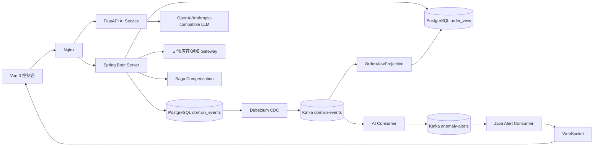

# EventGuard 架构审查与优化路线图

> 审查范围：`D:\File\Studyproject\EventGuard` 全仓库源代码、配置、Docker Compose、部署脚本和测试结果。
> 评级口径：P0=可能造成数据/资金/权限事故；P1=线上高概率故障或明显扩展瓶颈；P2=维护性、效率或长期演进问题。
> 说明：结论基于代码与配置静态审查，未连接真实生产环境验证容量、网络策略和实际密钥配置。

## 一、总体评价

EventGuard 是面向电商订单全生命周期的事件驱动管理平台，包含订单状态机、Event Sourcing、CQRS、Debezium CDC、Kafka、规则/统计/HMM 检测、LLM 根因分析、Saga 补偿、RBAC、WebSocket 和运维监控。

技术栈：

- 前端：Vue 3、Vite、TypeScript、Axios、Element Plus、ECharts。
- Java 后端：Java 17、Spring Boot 3.3.2、Spring JDBC、Spring Kafka、WebSocket、Actuator。
- AI：Python 3.11、FastAPI、kafka-python、scikit-learn、hmmlearn、httpx、PyJWT。
- 基础设施：PostgreSQL 16、Kafka 7.6 KRaft、Debezium 2.6、Nginx、Prometheus、Grafana、Loki、Alertmanager、Cloudflared。

主要证据：

- `eventguard-server/pom.xml:5-16,17-42`
- `eventguard-ui/package.json:5-28`
- `eventguard-ai/requirements.txt:1-13`
- `docker-compose.yml:12-147`

架构思想完整，但在可靠消费、支付回调安全、Projection 版本保护、共享状态、密钥治理和生产迁移方面仍有高风险。默认 `admin/operator/viewer` 账号及其密码属于演示入口，本次优化不修改它们；生产安全通过显式密钥配置、管理端点隔离和 provider 签名校验实现。

验证记录：Java 测试报告共 168 个测试、0 failures、0 errors、4 skipped；前端测试 39 个通过；当前环境 `vue-tsc` 不可用，前端 type-check 未完成；AI pytest 收集阶段因缺少 `prometheus_client` 受阻；Testcontainers 未找到 Docker 环境。

## 二、架构全景图



主链路：`Vue -> Nginx -> Java/AI -> PostgreSQL domain_events -> Debezium -> Kafka -> Projection/AI -> anomaly-alerts -> WebSocket/UI`。

## 三、维度深度分析

### 1. 整体架构与分层

**当前实现**：Java 采用模块化单体，命令处理、聚合、事件存储和读模型分层；AI 独立为 FastAPI 服务；Debezium 从 PostgreSQL 事件表 CDC 到 Kafka。证据：`eventguard-server/src/main/java/com/eventguard/command/handler/OrderCommandHandler.java:114-145`、`eventguard-server/src/main/java/com/eventguard/event/store/EventStoreJdbcImpl.java:31-83`、`debezium/conf/application.properties:19-42`。

**问题**：

- P0：Projection 和 AI Consumer 失败后主要记录日志并返回，可能出现消息被视为成功但读模型/告警永久缺失。
- P1：事件没有统一 schema version；Java、AI、Debezium 对消息格式依赖隐式约定。
- P1：Kafka、PostgreSQL 是单实例，分布式链路实际没有高可用。
- P2：模块边界没有契约门禁，但当前不宜过早拆成更多微服务。

**最佳实践对标**：保留模块化单体，先建立版本化事件 envelope、retry/DLT/replay 和明确的 bounded context；只有在吞吐、ownership 或故障隔离确实需要时才拆分服务。

**优化建议**：统一事件 envelope：`eventId/eventType/schemaVersion/aggregateId/aggregateVersion/traceId/payload`；所有消费者使用 at-least-once + 幂等 + DLT；增加 consumer lag、projection lag 和 DLT 指标。

```json
{"eventId":"uuid","eventType":"PaymentCompleted","schemaVersion":1,"aggregateId":"uuid","aggregateVersion":8,"traceId":"trace-id","payload":{}}
```

### 2. 前后端交互与 API 设计

**当前实现**：Axios 统一注入 JWT，Nginx 按路径代理 Java/AI；支付接口返回 `PAYMENT_REQUESTED` 或 `PAYMENT_FAILED`。证据：`eventguard-ui/src/api/http.ts:7-18`、`eventguard-server/src/main/java/com/eventguard/command/controller/OrderCommandController.java:61-75`。

**问题**：

- P0：`X-Command-Id` 缺失或非法时随机生成，客户端重试可能重复执行。
- P0：支付回调命令 ID 随机生成，且找不到 `externalRef` 时仍可能按请求体 `orderId` 推进状态。
- P1：DTO、page/size、金额和数量缺少系统化校验。
- P1：创建订单信任 body 中 `userId`，存在越权代下单风险。
- P1：`readAfterWrite` 使用 `Thread.sleep` 占用 Web 线程；前端 10 秒超时与 LLM 30 秒超时不一致。
- P2：缺少统一 OpenAPI、API version 和 Problem Details。

**最佳实践对标**：写接口强制 Idempotency-Key；查询使用 keyset pagination；错误统一返回 RFC 7807；资源归属从认证主体取得。

**优化建议**：合法 command ID 缺失/非法直接 400；为 DTO 增加 Bean Validation；限制 `size<=100`；支付回调改为 provider event ID 幂等；逐步引入 `/api/v1` 和 OpenAPI contract test。

```java
public record CreateOrderRequest(
        @NotNull String skuId,
        @NotNull @DecimalMin("0.01") BigDecimal totalAmount) {}
```

### 3. 数据持久层

**当前实现**：`domain_events` append-only，`(aggregate_id,event_version)` 唯一约束；有 `command_log`、快照和幂等消费表；查询使用 JDBC 手写 SQL。证据：`eventguard-server/src/main/resources/db/migration/V1__init.sql:2-23`、`V2__full_schema.sql:2-29`。

**问题**：

- P0：Projection 更新没有版本单调条件，旧事件 replay 可能覆盖新状态。
- P1：`spring.sql.init.mode=always` 执行“伪迁移”，并与 `postgres-init` 存在双份 schema。
- P1：`order_view` 缺少 `(status,updated_at,order_id)` 复合索引。
- P1：`RuleContextLoader` 每条事件重复扫描历史事件，JSONB 字段无针对性索引。
- P1：支付 provider 调用发生在 `gateway_request` 落库之前，崩溃窗口可能产生孤儿支付。
- P2：事件 payload 没有显式 schema version，`domain_events` 长期增长需要分区/归档。

**最佳实践对标**：Projection 采用 `WHERE version < incomingVersion`；生产使用 Flyway/Liquibase；对高频 JSONB 字段建立表达式索引；外部副作用先建立本地 pending 记录。

**优化建议**：

```sql
UPDATE order_view
SET status = ?, version = ?, updated_at = now()
WHERE order_id = ? AND version < ?;

CREATE INDEX CONCURRENTLY idx_order_view_status_updated
ON order_view(status, updated_at DESC, order_id);
```

迁移时先引入 Flyway 只读校验，再关闭 `spring.sql.init.mode=always`，最后统一空库初始化入口。

### 4. 缓存与性能优化

**当前实现**：LLM cache、EventWindow、AlertDeduper、AnomalyStore、RecentAlertsBuffer、限流窗口和 Saga 均主要为进程内存。证据：`eventguard-ai/app/cache/llm_cache.py:11-52`、`eventguard-ai/app/detector/event_window.py:7-25`、`eventguard-server/src/main/java/com/eventguard/common/security/RateLimitFilter.java:31-40`。

**问题**：

- P1：RYW 轮询和 `Thread.sleep` 会占用 Web 线程。
- P1：深分页、额外 `count(*)` 和重复历史扫描在数据增长后会放大数据库压力。
- P1：单实例限流在多副本环境可被绕过。
- P1：AI cache 使用 Python `hash(prompt)`，跨进程不稳定且存在碰撞风险。
- P2：重启后 EventWindow、Deduper、会话和告警历史状态不连续。

**最佳实践对标**：热点数据使用 Caffeine，跨实例状态使用 Redis；列表使用 keyset pagination；外部 HTTP 配置完整超时；缓存必须具备命中率和失效指标。

**优化建议**：

```python
import hashlib

def cache_key(provider, model, temperature, prompt):
    digest = hashlib.sha256(prompt.encode("utf-8")).hexdigest()
    return f"{provider}:{model}:{temperature}:{digest}"
```

先限制 page/size 和 SQL 超时，再迁移限流、去重、窗口和 WebSocket 广播到 Redis。

### 5. 外部 AI API 集成

**当前实现**：支持 OpenAI-compatible/Anthropic-compatible provider；根因分析使用 JSON、Pydantic 和 evidence 校验；NL 查询有确定性摘要降级。证据：`eventguard-ai/app/analyzer/llm_client.py:70-116`、`root_cause.py:80-131`。

**问题**：

- P0：没有统一用户级额度、token 预算和并发上限，存在成本失控风险。
- P0：异常描述、事件和上下文直接拼接 Prompt，没有不可信数据隔离。
- P1：无统一 retry/backoff、熔断、provider fallback 和 semaphore。
- P1：OpenAI body 未发送 `max_tokens`。
- P1：根因分析网络异常直接 422；async 流程调用同步 `httpx.Client`。
- P2：缺少 Prompt version、模型版本和质量回归指标。

**最佳实践对标**：并发控制、预算、熔断、provider fallback、结构化输出、Prompt 版本、敏感字段脱敏和人工采纳率指标缺一不可。

**优化建议**：

```python
LLM_LIMIT = asyncio.Semaphore(8)

async def call_llm(client, prompt):
    async with LLM_LIMIT:
        for attempt, delay in enumerate((0.5, 1.5, 3.0)):
            try:
                return await asyncio.wait_for(client.generate_json(prompt), 12)
            except Exception:
                if attempt == 2:
                    raise
                await asyncio.sleep(delay)
```

外部事件使用 `<untrusted_event_data>` 边界；OpenAI 请求补充 `max_tokens`；根因分析失败返回规则化报告而不是直接错误。

### 6. 异步与消息队列

**当前实现**：Debezium 监听 PostgreSQL logical replication，使用 `aggregate_id` 作为 Kafka key；Java 和 AI 分别消费 `domain-events`，AI 发布 `anomaly-alerts`。证据：`debezium/conf/application.properties:29-42`、`eventguard-ai/app/kafka_consumer.py:40-85`。

**问题**：

- P0：AI Consumer `enable_auto_commit=True`，handler 异常时 offset 可能自动提交。
- P0：Projection/Alert Consumer 没有 retry topic 和 DLT，坏消息只写日志。
- P1：Kafka 副本数和 ISR 都为 1。
- P1：AI Publisher 每条消息同步 flush，阻塞消费线程。
- P2：没有统一 schema registry、回放工具和 lag/DLT 告警。

**最佳实践对标**：关闭自动提交，成功后 commit；失败进入 retry/DLT；生产 producer 开启幂等和 `acks=all`；Kafka 至少 3 broker。

**优化建议**：

```python
KafkaConsumer(
    topic,
    bootstrap_servers=servers,
    group_id=group_id,
    enable_auto_commit=False,
    max_poll_records=50,
)
```

Java 侧使用 `DefaultErrorHandler + DeadLetterPublishingRecoverer`，成功后再 ack。

### 7. 安全与权限

**当前实现**：Java 使用 JWT HS256 和 token version；AI 校验 JWT permissions；内部调用使用 API Key；WebSocket query string 携带 JWT；默认账号由 `AuthDataSeeder` 初始化。演示账号密码属于项目访问入口，本次不修改。

**问题**：

- P0：默认 secret、machine key、数据库密码存在。
- P0：支付回调只有共享 API Key，没有 provider signature、timestamp、nonce、事件绑定。
- P0：Actuator 放行且暴露 health/info/metrics/prometheus。
- P0：WebSocket 允许任意 Origin。
- P1：AI 不校验 Java 侧 token version 和用户启用状态。
- P1：创建订单信任 body 的 `userId`；JWT 放 localStorage 有 XSS 风险。

**最佳实践对标**：生产密钥强制显式注入；管理端点独立内网；Webhook 使用签名与重放保护；用户身份由 principal 取得；WebSocket 限制 Origin 或使用短时票据。

**优化建议**：保留演示账号密码，但增加非破坏性安全保护：显式生产 secret 优先、发现默认 secret 时仅在 `EG_PROFILE=demo` 允许启动；生产环境关闭外网管理端口；对 webhook 增加 HMAC/timestamp/nonce；不再从 body 获取用户 ID。

### 8. 可扩展性与微服务倾向

**当前实现**：Java 模块化单体，AI 独立服务，Gateway 使用 ports & adapters，Kafka 已形成异步边界。

**问题**：

- P1：Saga、WebSocket sessions、RecentAlertsBuffer、AI 会话/窗口/去重均为单实例状态。
- P1：`PaymentCoordinator` 单线程 scheduler 的延迟任务重启后丢失。
- P2：共享 PostgreSQL 事件契约缺少独立版本治理。

**最佳实践对标**：先持久化 Saga，再共享化限流/告警/会话状态；只有在独立扩展或故障隔离有明确收益时拆服务。

**优化建议**：增加 `saga_instance` 表保存状态；使用 Redis Pub/Sub 做 WebSocket fan-out；将 scheduler 任务改为持久化 pending job，由 worker 扫描执行。

### 9. 代码质量与可维护性

**当前实现**：Java 有较多领域单测，AI 有 JSON/Pydantic 校验，代码使用 `ponytail` 注释记录已知边界。

**问题**：

- P1：Java Dockerfile 使用 `mvn package -DskipTests`。
- P1：大量宽泛 `catch (Exception)` 返回空结果，可能掩盖数据故障。
- P1：Java、AI、前端缺少统一 contract test 和 CI 依赖门禁。
- P2：字段注入和前端 `any` 较多，缺少静态质量工具。

**最佳实践对标**：CI 通过 `verify/type-check/pytest` 后再构建镜像；异常分类为可重试、不可重试、坏数据；启用 Checkstyle、SpotBugs、Ruff、mypy 和严格 TypeScript。

**优化建议**：镜像构建只消费已通过 CI 的 jar；新增事件消费者 contract test；把静默降级改为带错误码和指标的降级。

### 10. 日志、监控与告警

**当前实现**：Java Micrometer/Actuator、AI prometheus_client、Prometheus、Grafana、Loki、Promtail 已存在。

**问题**：

- P0：Alertmanager webhook 指向 `127.0.0.1:65534`，生产告警无法送达。
- P1：没有 Kafka lag、DLT、Projection backlog、DB pool、Postgres/Kafka exporter 指标。
- P1：AI trace 只保存在内存；用户原始问题可能写入日志。
- P1：`/health` 可能只反映进程状态，不代表依赖可用。
- P2：没有完整 OpenTelemetry trace 和 SLO 告警。

**最佳实践对标**：围绕命令成功率、Projection lag、支付回调、LLM fallback、DLT 和数据库连接池建立 SLO；告警必须可接收、可定位、可恢复。

**优化建议**：修复 Alertmanager receiver；增加 `consumer_lag`、`projection_lag_seconds`、`event_dlt_total`、`llm_cost_estimate`；将 AI trace 写入 Loki/审计表并脱敏。

### 11. 部署与运维

**当前实现**：Docker Compose 提供资源限制、健康检查、自动重启、优雅停机、备份和事件归档脚本。

**问题**：

- P0：Kafka/PostgreSQL 单实例，无法提供真正 HA。
- P0：多个基础设施端口直接映射宿主机，若安全组未限制会扩大攻击面。
- P1：`cloudflared:latest` 未固定；镜像构建跳过测试；SQL 初始化不是正式迁移。
- P1：`depends_on: service_started` 不等价于 readiness；备份有校验但缺少自动恢复演练。
- P2：没有灰度、自动回滚、SBOM 和发布签名。

**最佳实践对标**：托管 PostgreSQL/Kafka 或多节点集群；内部组件不暴露公网；固定 digest；Flyway/Liquibase；liveness/readiness/startup 分离；定期恢复演练。

**优化建议**：短期只保留 80/443 外部入口；固定镜像版本；CI 生成并扫描镜像；中期迁移托管数据库和三节点 Kafka；每月执行恢复演练。

### 12. 线上风险专项

| 风险 | 等级 | 触发条件 | 后果 |
|---|---:|---|---|
| Projection 消费异常被吞 | P0 | JSON/数据库/代码异常 | 订单列表状态落后 |
| AI Kafka 自动提交 | P0 | handler 异常或进程中断 | 告警事件丢失 |
| 支付回调伪造 | P0 | key 泄露或伪造 webhook | 错误标记 PAID |
| 旧事件覆盖新 Projection | P0 | replay/乱序 | 读模型回退 |
| 默认密钥被使用 | P0 | 未配置环境变量 | JWT/API/管理账号被接管 |
| Saga 内存状态丢失 | P1 | 重启/多副本 | 补偿卡住 |
| LLM 成本失控 | P1 | 高频调用/恶意 Prompt | 账单异常、AI 拥塞 |
| WebSocket 单实例广播 | P1 | 多副本/重启 | 部分用户收不到告警 |

应急原则：优先保护 `domain_events`，暂停自动副作用，核对 provider 真实状态，修复消费者后再 replay；数据库恢复必须先恢复到新实例验证，禁止未经确认直接删除事实事件。

## 四、优化路线图

### 第 0 周：立即止血

- 保留演示账号密码，但轮换生产 JWT/machine/DB secret。
- Actuator 移至内网管理端口。
- 支付回调增加 provider signature、timestamp、nonce、event ID。
- 缺少 command ID 直接 400。
- Kafka 关闭 auto commit，加入 retry/DLT。
- 修复 Alertmanager webhook。
- 完成数据库备份恢复演练。

### 第 1 周：一致性与接口边界

- Projection 增加版本单调条件。
- 统一事件 envelope/schema version。
- 增加 DTO 校验、分页上限、订单归属校验。
- 增加 `order_view` 复合索引。
- 修复库存 HTTP request/read timeout。
- 统一错误格式和 traceId。

### 第 2 周：共享状态与扩展性

- Saga 持久化。
- 限流、去重、窗口、会话、告警迁移 Redis。
- WebSocket Redis Pub/Sub。
- Kafka lag、DLT、Projection lag 指标。
- keyset pagination。

### 第 3 周：AI 治理

- LLM semaphore、预算、熔断、provider fallback。
- Prompt 版本化、不可信数据隔离、字段脱敏。
- OpenAI `max_tokens`。
- 质量回归集和人工采纳率指标。

### 第 4 周：部署与可观测性

- Flyway/Liquibase，关闭 `spring.sql.init.mode=always`。
- 固定镜像版本和 digest。
- CI 增加测试、类型检查、依赖/镜像扫描。
- 增加数据库、Kafka、容器 exporter 和 SLO。

### 第 5 周：容量与灾备

- Kafka 三节点、PostgreSQL 主备/托管化。
- 执行数据库、Kafka、Debezium、AI provider 故障演练。
- 明确 RPO/RTO，建立灰度和回滚流程。

## 五、技术债务速览

| 优先级 | 项目 | 证据 | 后果 |
|---|---|---|---|
| P0 | Kafka 自动提交 | `eventguard-ai/app/kafka_consumer.py:42-48` | 消息丢失 |
| P0 | 消费异常无 DLT | `OrderViewProjection.java:48-66` | Projection 静默缺失 |
| P0 | 回调仅 API Key | `GatewayCallbackController.java:38-45` | 支付回调伪造 |
| P0 | 默认 secret | `JwtService.java:26-35` | 凭据接管 |
| P0 | Actuator 放行 | `application.yml:47-51` | 运维信息暴露 |
| P0 | Projection 无版本保护 | `OrderViewProjection.java:71-121` | 旧事件覆盖新状态 |
| P1 | command ID 随机兜底 | `OrderCommandController.java:30-43` | 幂等失效 |
| P1 | 外部支付先于本地落库 | `PaymentCoordinator.java:73-84` | 孤儿支付 |
| P1 | Saga 进程内 | `CompensationSaga.java:40-44` | 重启丢状态 |
| P1 | 深分页/重复统计 | `OrderViewRepository.java:48-79` | 数据库慢查询 |
| P1 | LLM 无预算/并发控制 | `llm_client.py:150-172` | 成本失控 |
| P1 | Kafka 单节点 | `docker-compose.yml:33-54` | 节点故障中断 |
| P1 | Docker 跳过测试 | `eventguard-server/Dockerfile:6` | 回归进入生产 |
| P2 | 无事件 schema registry | `debezium/conf/application.properties:19-42` | 演进困难 |
| P2 | AI trace 仅内存 | `trace_log.py:14-38` | 重启无法追溯 |

## 六、核心风险应急建议

1. Projection 落后：暂停 replay，比较 `domain_events` 和 `order_view` 最大版本，修复消费者后从指定 offset/version 重放。
2. 支付异常：暂停 callback 入口和自动推进，轮换 key，对账 provider、`gateway_request` 与领域事件。
3. Kafka 故障：保护 PostgreSQL，不删除 `domain_events`；恢复 broker 后验证 offset、topic 和 DLT 再继续消费。
4. AI 故障/成本激增：关闭高成本根因和 Agent，保留规则引擎与确定性摘要，启用预算和备用 provider。
5. 凭据泄露：轮换 secret，递增 `token_version`，检查审计、支付和补偿记录。
6. Saga 卡住：查询长时间 PENDING 审批，核对外部副作用，使用幂等 command ID 手动恢复。

## 实施记录（已落地）

本轮按 P0 → P1 顺序完成了可在当前单体架构内安全上线的改动，未修改三种演示账号密码（`admin123456`、`operator123456`、`viewer123456`）：

- **消费可靠性**：`eventguard-ai/app/kafka_consumer.py` 的 `EventKafkaConsumer._consume_loop` 改为手动提交，失败消息有限重试，DLT 发布成功后才提交原 offset；Java 的 `OrderViewProjection.on`、`SagaTrigger.on`、`AnomalyAlertConsumer.on` 不再吞异常，统一由 `KafkaConsumerConfig.kafkaErrorHandler` 以 `DefaultErrorHandler + DeadLetterPublishingRecoverer` 处理。
- **Projection 一致性**：`eventguard-server/src/main/java/com/eventguard/query/projection/OrderViewProjection.java` 的更新 SQL 增加 `version < incomingVersion` 单调保护，避免乱序/重放覆盖新状态。
- **支付回调安全**：`GatewayCallbackController.callback` 保留 demo 的 `X-API-Key` 入口；生产可通过 `EG_GATEWAY_CALLBACK_SIGNATURE_REQUIRED=true` 开启 HMAC、时间窗口和 provider 校验。`GatewayCallbackService.doProcess` 找不到 `gateway_request` 或订单不匹配时拒绝派发，并使用稳定 command ID。
- **生产密钥保护**：新增 `eventguard-server/src/main/java/com/eventguard/auth/config/ProductionSecurityGuard.java`，仅当 `EG_ENV=prod|production` 时拒绝默认 JWT secret、machine key、通配 WebSocket Origin 和关闭的 command ID 强制；demo 模式仍可直接登录演示账号。
- **查询与数据库**：`OrderQueryController.listOrders` 限制 `page/size`，`V6__query_indexes.sql` 增加订单状态/更新时间、事件聚合版本索引；Actuator 暴露收敛为 `health,prometheus`。
- **边界与外部调用**：demo 默认允许 body `userId`、SQL init 和随机 command ID 以保证面试演示链路；生产由 `EG_ALLOW_BODY_USER_ID=false`、`EG_SQL_INIT_MODE=never`、`EG_REQUIRE_COMMAND_ID=true` 切换为认证主体和显式幂等键。`RuleContextLoader.load` 避免重复统计查询，`HttpInventoryGateway` 为每个请求增加 5 秒 request timeout。
- **AI 成本与稳定性**：`LLMClient._complete` 增加并发 semaphore、429/5xx/timeout retry/backoff 和 OpenAI `max_tokens`；`LLMCache._key` 改为 SHA-256；`PromptBuilder.build` 对外部数据增加不可信数据边界；事件历史增加 async HTTP 调用；`EventWindow` 增加 aggregate 数量上限。
- **部署与告警**：`eventguard-server/Dockerfile` 不再跳过 Maven tests；Alertmanager URL 改为 `ALERT_WEBHOOK_URL` 注入并启用 config expand-env。

验证结果：Java `mvn test` 通过（170 tests，0 failures，4 skipped，Docker Testcontainers 因本机无 Docker 跳过）；AI `python -m pytest -q` 通过（123 passed）；前端 Vitest 通过（39 passed）。前端 `npm run type-check` 仍受当前环境缺少 `vue-tsc` 影响，未能执行；Docker Compose 校验同样受当前 Docker CLI 未安装 Compose plugin 影响。

## 七、总结

项目的亮点在于 Event Sourcing、CQRS、Debezium + Kafka、规则/统计/HMM + LLM 分层检测、Gateway 抽象、Saga 补偿、RBAC、Prometheus/Loki 和 chaos/benchmark 工具链。

下一阶段重点不是继续堆功能，而是把幂等、重试、DLT、权限边界、密钥管理、状态持久化、监控告警和恢复演练做成生产闭环。

## 八、本轮本地调试与体验优化补充

- **本地调试**：新增 `eventguard-server/src/main/resources/application-local.yml`，IDEA 使用 `local` profile 时将 Kafka、PostgreSQL 指向 `localhost`；新增 `docs/local-development.md` 和 `eventguard-ai/.env.local.example`，明确 IDEA、FastAPI、Vite 的启动顺序。未改动生产 Docker 配置。
- **LLM 配置中心**：`eventguard-ai/app/main.py` 新增 `GET/PUT /ai/settings/llm` 与 `POST /ai/settings/llm/reset`，复用 `user:manage` 权限；默认仍读取 `EG_LLM_*`，API key 只返回掩码，配置仅驻留 AI 进程内存，修改后重建 LLM 相关惰性单例。
- **前端体验**：`eventguard-ui/src/App.vue` 改为响应式侧栏 + 顶部状态栏 + 统一工作区主题；`Login.vue` 增加三种演示账号快速填充但不改密码；新增 `admin/LlmSettings.vue`，业务页沿用现有功能并统一卡片、表格、间距和移动端布局。
- **最新验证**：AI `python -m pytest -q` 通过（125 passed）；前端 `npm test -- --run` 通过（39 passed）、`npm run type-check` 通过、`npm run build` 通过；Vite 本地 `http://127.0.0.1:3000/` 返回 200；Java `mvn test -q` 退出码 0。
